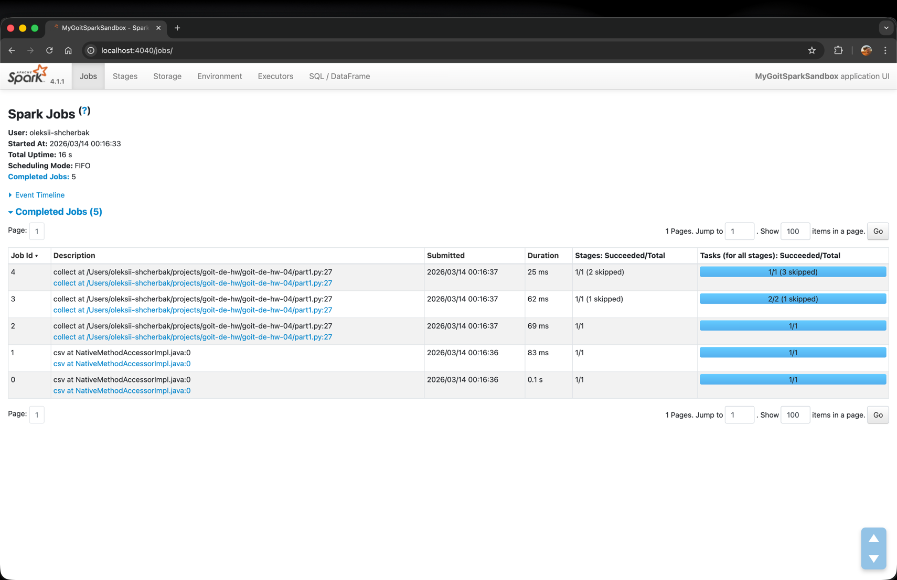
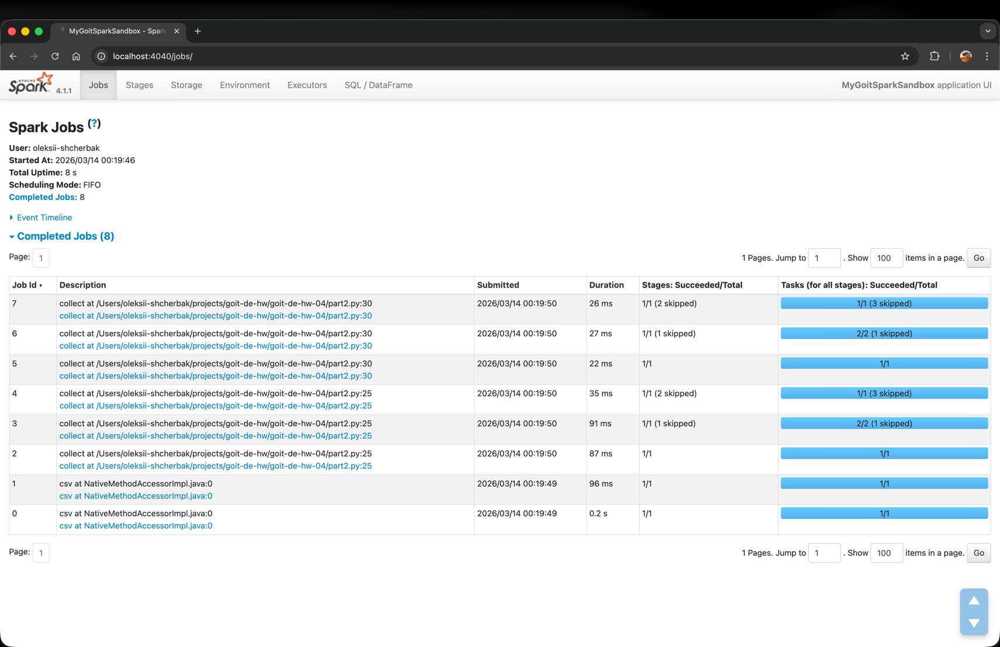
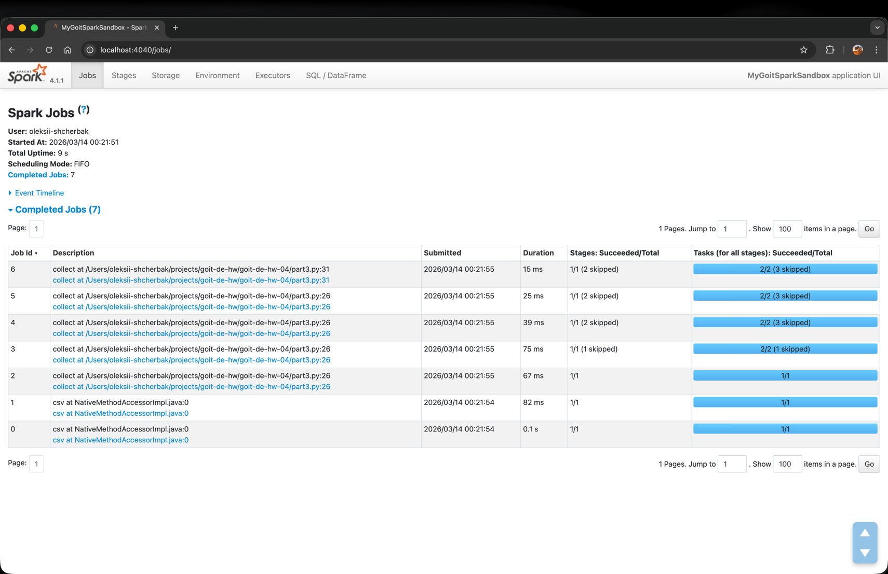

# goit-de-hw-04

## Part 1 - 5 Jobs

A single `.collect()` at the end triggers one full execution plan: read CSV → repartition → filter → groupBy → count → filter. Spark compiles the entire chain into one optimised run.

---

## Part 2 — 8 Jobs

Adding an intermediate `.collect()` forces Spark to execute the full pipeline twice. The first `collect()` runs the groupBy chain completely. The second `collect()` cannot reuse that result - Spark recomputes everything from scratch, including re-reading the CSV. This duplication produces 3 additional Jobs compared to Part 1.

---

## Part 3 — 7 Jobs

Adding `.cache()` stores the grouped result in memory after the first `collect()`. When the second `collect()` runs, Spark reads from memory instead of recomputing from the CSV. This eliminates one full recomputation cycle, reducing the count by 1 compared to Part 2.

---

## Conclusion

`cache()` is useful when the same intermediate DataFrame is used more than once. Without it, Spark recomputes the entire lineage from scratch on every Action call. With it, the result is stored in RAM and reused directly, saving both time and Jobs.